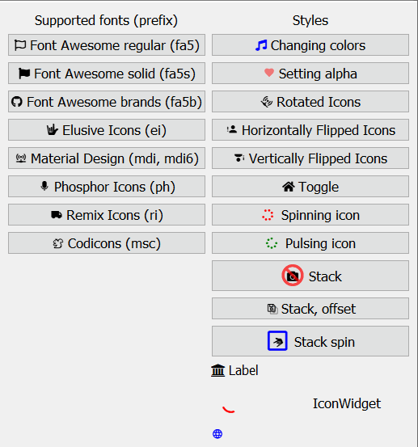
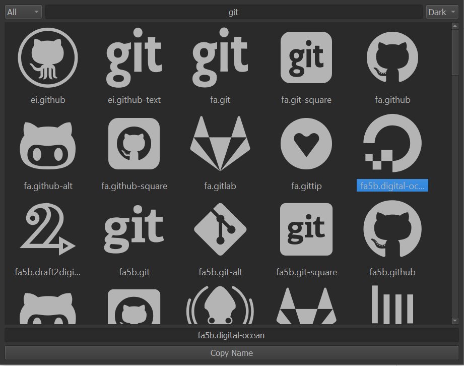

# QtAwesome (with Qt.py)

_This fork is refactored to use [Qt.py](https://github.com/mottosso/Qt.py) as dependency instead of [qtpy](https://github.com/spyder-ide/qtpy.git)_

[](./LICENSE)
[](https://pypi.org/project/qtawesome/)
[](https://www.anaconda.com/download/)
[](https://www.anaconda.com/download/)
[](#backers)
[](https://gitter.im/spyder-ide/public)<br>
[](https://github.com/spyder-ide/qtawesome)
[](https://github.com/spyder-ide/qtawesome/actions)
[](https://qtawesomedocs.readthedocs.io/en/latest/?badge=latest)

*Copyright © 2015–2021 Spyder Project Contributors*


## Description

QtAwesome enables iconic fonts such as Font Awesome and Elusive Icons
in PyQt and PySide applications.

It started as a Python port of the [QtAwesome](
https://github.com/Gamecreature/qtawesome)
C++ library by Rick Blommers.


## Installation

Using `conda`:

```
conda install qtawesome
```

or using `pip` (only if you don't have conda installed):

```
pip install qtawesome
```


## Usage

### Supported Fonts

QtAwesome identifies icons by their **prefix** and their **icon name**, separated by a *period* (`.`) character.

The following prefixes are currently available to use:

- [**FontAwesome**](https://fontawesome.com):

  - FA 5.9.0 features 1,534 free icons in different styles:

    - `fa5` prefix has [152 icons in the "**regular**" style.](https://fontawesome.com/icons?d=gallery&s=regular&m=free)
    - `fa5s` prefix has [1000 icons in the "**solid**" style.](https://fontawesome.com/icons?d=gallery&s=solid&m=free)
    - `fa5b` prefix has [449 icons of various **brands**.](https://fontawesome.com/icons?d=gallery&s=brands&m=free)

  - `fa` is the legacy [FA 4.7 version with its 675 icons](https://fontawesome.com/v4.7.0/icons/) but **all** of them (*and more!*) are part of FA 5.x so you should probably use the newer version above.

- `ei` prefix holds [**Elusive Icons** 2.0 with its 304 icons](http://elusiveicons.com/icons/).

- [**Material Design Icons**](https://cdn.materialdesignicons.com)

  - `mdi6` prefix holds [**Material Design Icons** 6.3.95 with its 6395 icons.](https://cdn.materialdesignicons.com/6.3.95/)

  - `mdi` prefix holds [**Material Design Icons** 5.9.55 with its 5955 icons.](https://cdn.materialdesignicons.com/5.9.55/)

- `ph` prefix holds [**Phosphor** 1.3.0 with its 4470 icons (894 icons * 5 weights: Thin, Light, Regular, Bold and Fill).](https://github.com/phosphor-icons/phosphor-icons)

- `ri` prefix holds [**Remix Icon** 2.5.0 with its 2271 icons.](https://github.com/Remix-Design/RemixIcon)

- `msc` prefix holds Microsoft's [**Codicons** 0.0.25 with its 385 icons.](https://github.com/microsoft/vscode-codicons)

### Examples

```python
import qtawesome as qta
```

- Use Font Awesome, Elusive Icons, Material Design Icons, Phosphor, Remix Icon or Microsoft's Codicons.

```python
# Get FontAwesome 5.x icons by name in various styles:
fa5_icon = qta.icon('fa5.flag')
fa5_button = QtWidgets.QPushButton(fa5_icon, 'Font Awesome! (regular)')
fa5s_icon = qta.icon('fa5s.flag')
fa5s_button = QtWidgets.QPushButton(fa5s_icon, 'Font Awesome! (solid)')
fa5b_icon = qta.icon('fa5b.github')
fa5b_button = QtWidgets.QPushButton(fa5b_icon, 'Font Awesome! (brands)')

# or Elusive Icons:
asl_icon = qta.icon('ei.asl')
elusive_button = QtWidgets.QPushButton(asl_icon, 'Elusive Icons!')

# or Material Design Icons:
apn_icon = qta.icon('mdi6.access-point-network')
mdi6_button = QtWidgets.QPushButton(apn_icon, 'Material Design Icons!')

# or Phosphor:
mic_icon = qta.icon('ph.microphone-fill')
ph_button = QtWidgets.QPushButton(mic_icon, 'Phosphor!')

# or Remix Icon:
truck_icon = qta.icon('ri.truck-fill')
ri_button = QtWidgets.QPushButton(truck_icon, 'Remix Icon!')

# or Microsoft's Codicons:
squirrel_icon = qta.icon('msc.squirrel')
msc_button = QtWidgets.QPushButton(squirrel_icon, 'Codicons!')

```

- Apply some styling

```python
# Styling icons
styling_icon = qta.icon('fa5s.music',
                        active='fa5s.balance-scale',
                        color='blue',
                        color_active='orange')
music_button = QtWidgets.QPushButton(styling_icon, 'Styling')
```

- Set alpha in colors

```python
# Setting an alpha of 120 to the color of this icon. Alpha must be a number
# between 0 and 255.
icon_with_alpha = qta.icon('mdi.heart',
                           color=('red', 120))
heart_button = QtWidgets.QPushButton(icon_with_alpha, 'Setting alpha')
```

- Stack multiple icons

```python
# Stacking icons
camera_ban = qta.icon('fa5s.camera', 'fa5s.ban',
                      options=[{'scale_factor': 0.5,
                                'active': 'fa5s.balance-scale'},
                               {'color': 'red'}])
stack_button = QtWidgets.QPushButton(camera_ban, 'Stack')
stack_button.setIconSize(QtCore.QSize(32, 32))
```

- Animations

```python
# Spining icons
spin_button = QtWidgets.QPushButton(' Spinning icon')
spin_icon = qta.icon('fa5s.spinner', color='red',
                     animation=qta.Spin(spin_button))
spin_button.setIcon(spin_icon)
```

- Display Icon as a widget

```python
# Spining icon widget
spin_widget = qta.IconWidget()
spin_icon = qta.icon('mdi.loading', color='red',
                     animation=qta.Spin(spin_widget))
spin_widget.setIcon(spin_icon)

# Simple icon widget
simple_widget = qta.IconWidget('mdi.web', color='blue')
```

- Screenshot




## Other features

- QtAwesome comes bundled with _Font Awesome_, _Elusive Icons_, _Material Design_
  _Icons_, _Phosphor_, _Remix Icon_ and Microsoft's _Codicons_
  but it can also be used with other iconic fonts. The `load_font`
  function allows to load other fonts dynamically.
- QtAwesome relies on the [QtPy](https://github.com/spyder-ide/qtpy.git)
  project as a compatibility layer on the top ot PyQt or PySide.

### Icon Browser

QtAwesome ships with a browser that displays all the available icons.  You can
use this to search for an icon that suits your requirements and then copy the
name that should be used to create that icon!

Once installed, run `qta-browser` from a shell to start the browser.




## License

MIT License. Copyright 2015 - The Spyder development team.
See the [LICENSE](LICENSE) file for details.

The [Font Awesome](https://github.com/FortAwesome/Font-Awesome/blob/master/LICENSE.txt) and [Elusive Icons](http://elusiveicons.com/license/) fonts are licensed under the [SIL Open Font License](http://scripts.sil.org/OFL).

The Phosphor font is licensed under the [MIT License](https://github.com/phosphor-icons/phosphor-icons/blob/master/LICENSE).

The [Material Design Icons](https://github.com/Templarian/MaterialDesign/blob/master/LICENSE) font is licensed under the [Apache License Version 2.0](http://www.apache.org/licenses/LICENSE-2.0).

The Remix Icon font is licensed under the [Apache License Version 2.0](https://github.com/Remix-Design/remixicon/blob/master/License).

Microsoft's Codicons are licensed under a [Creative Commons Attribution 4.0 International Public License](https://github.com/microsoft/vscode-codicons/blob/master/LICENSE).

## Sponsors

Spyder and its subprojects are funded thanks to the generous support of

[](https://www.quansight.com/)[](https://numfocus.org/)

and the donations we have received from our users around the world through [Open Collective](https://opencollective.com/spyder/):

[](https://opencollective.com/spyder#support)
